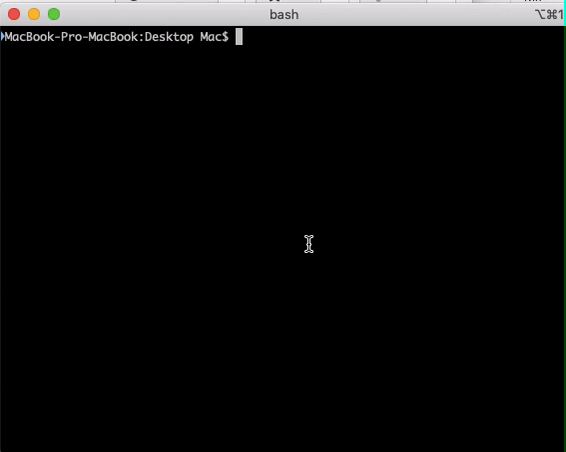
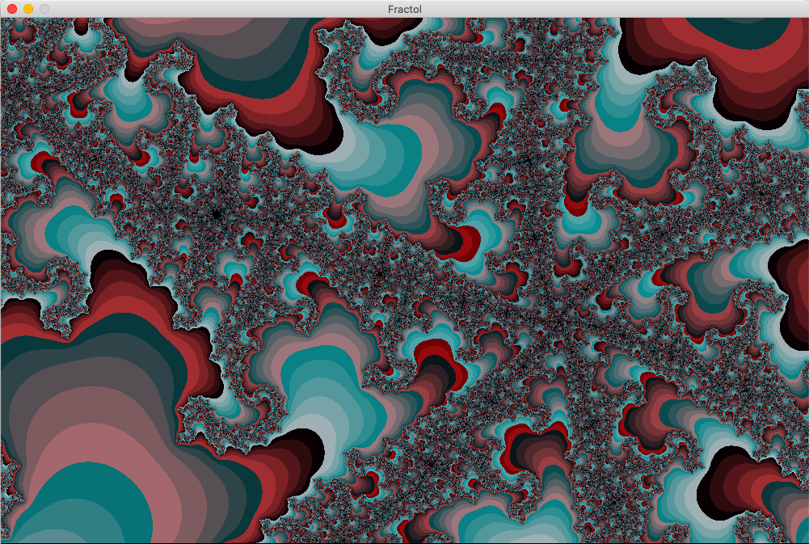
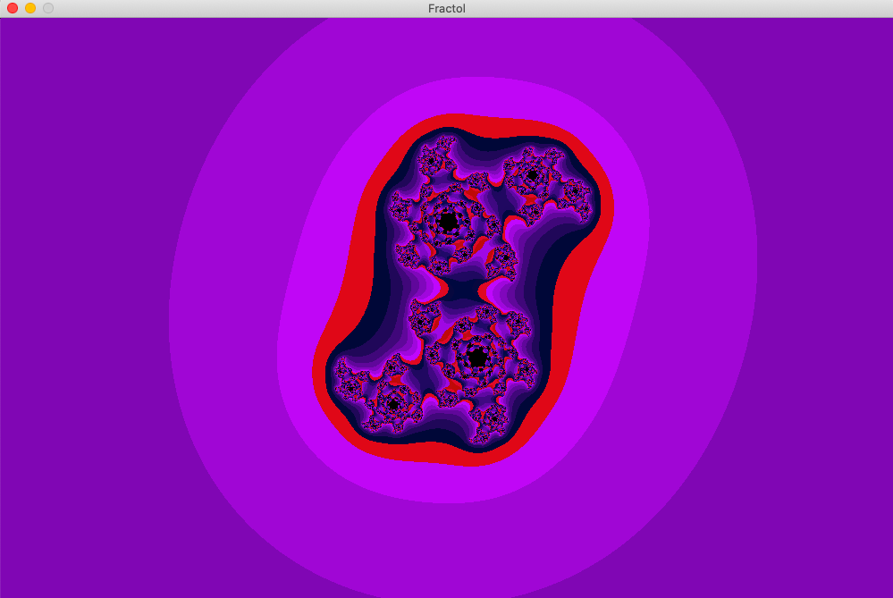
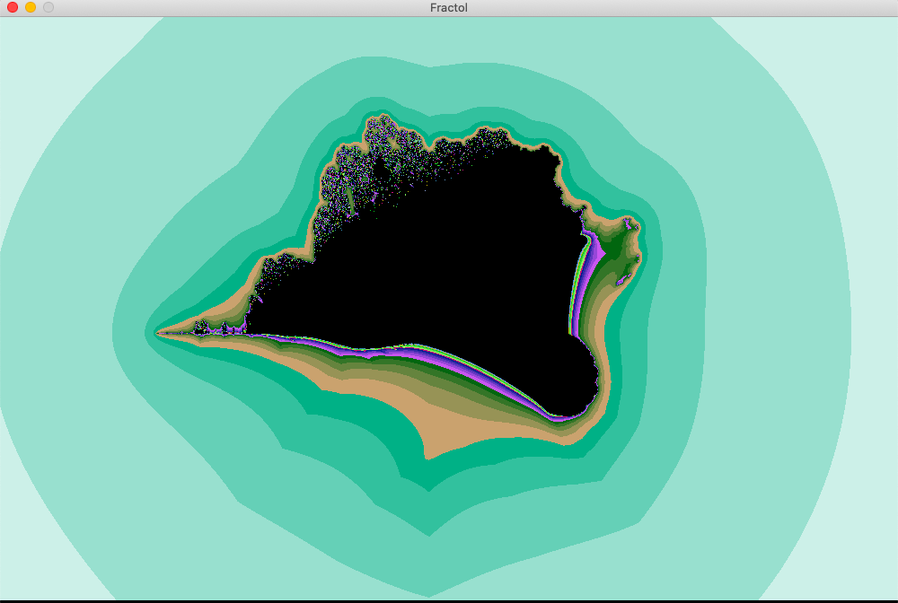
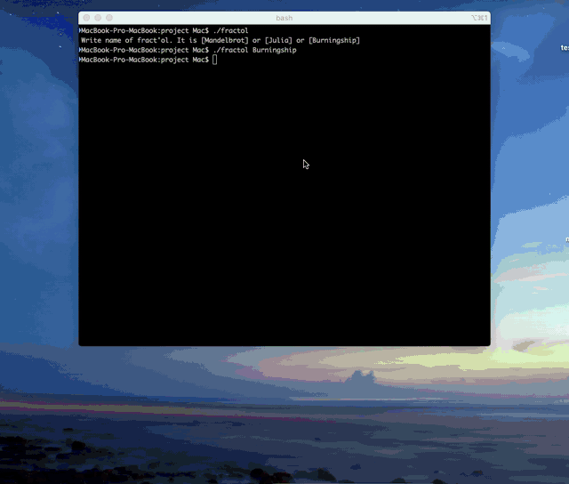

# Fract-ol
This project’s goal is to create a small fractal exploration program.
## Installation
```
git clone https://github.com/pechenovadasha/Fract-ol.git
```
```
cd direct/project and run make
```

```
$> ./fractol Mandelbrot
```




```
$> ./fractol Julia
```




```
$> ./fractol Burningship
```





## Keys
```
1)Increase and decrease in the mouse
2)Change theme '1' '2' '3' '4' '5'
3)Change color 'c'
```
